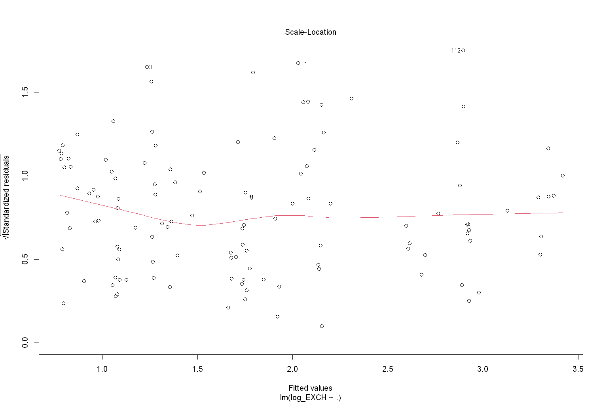
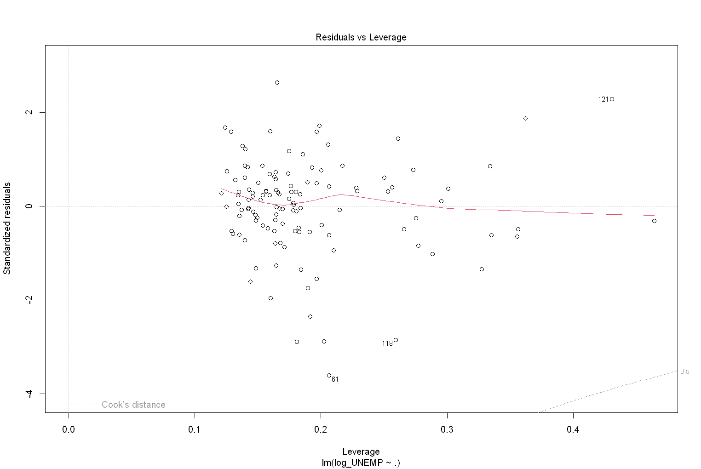

```R
data_path <- "C:/Users/kayra/Desktop/Okul/3-2/EVDS_updated.xlsx"
```

#Most of the data manipulatipon have been made through excel. 
#I uploaded the excel file to the repository as well, if one wants to check formulas.


```R
require(openxlsx) #library(openxlsx)
require(ggplot2)
require(data.table)
require(skimr)
require(GGally)
require(ggcorrplot)
require(forecast)

options(repr.plot.width=12.7, repr.plot.height=8.5)

exchange_rate=read.xlsx(data_path,sheet='data_EXCH') #Reading the data

exchange_rate$DATE <- as.Date(exchange_rate$DATE, format = "%Y-%m-%d")  #Fixing the date format
exchange_rate
```


<table class="dataframe">
<caption>A data.frame: 121 × 9</caption>
<thead>
	<tr><th></th><th scope=col>DATE</th><th scope=col>EXCH</th><th scope=col>MEVTR</th><th scope=col>REZV</th><th scope=col>M3ARZ</th><th scope=col>PAYTP</th><th scope=col>CPIG</th><th scope=col>CBBS</th><th scope=col>BIST100</th></tr>
	<tr><th></th><th scope=col>&lt;date&gt;</th><th scope=col>&lt;dbl&gt;</th><th scope=col>&lt;dbl&gt;</th><th scope=col>&lt;dbl&gt;</th><th scope=col>&lt;dbl&gt;</th><th scope=col>&lt;dbl&gt;</th><th scope=col>&lt;dbl&gt;</th><th scope=col>&lt;dbl&gt;</th><th scope=col>&lt;dbl&gt;</th></tr>
</thead>
<tbody>
	<tr><th scope=row>1</th><td>2014-01-01</td><td>2.220845</td><td> 8.94</td><td>124270</td><td> 970753204</td><td>2585.33</td><td>233.54</td><td>265441272</td><td>648.565</td></tr>
	<tr><th scope=row>2</th><td>2014-02-01</td><td>2.216745</td><td>10.16</td><td>127691</td><td> 972982043</td><td>2150.60</td><td>234.54</td><td>270204556</td><td>633.825</td></tr>
	<tr><th scope=row>3</th><td>2014-03-01</td><td>2.221786</td><td>10.97</td><td>126051</td><td> 980086715</td><td>1022.88</td><td>237.18</td><td>262750465</td><td>658.155</td></tr>
	<tr><th scope=row>4</th><td>2014-04-01</td><td>2.131295</td><td>10.83</td><td>129732</td><td> 979170647</td><td> 795.69</td><td>240.37</td><td>268243802</td><td>719.965</td></tr>
	<tr><th scope=row>5</th><td>2014-05-01</td><td>2.094565</td><td>10.39</td><td>130591</td><td> 969106400</td><td> 488.00</td><td>241.32</td><td>268166837</td><td>772.075</td></tr>
	<tr><th scope=row>6</th><td>2014-06-01</td><td>2.119538</td><td> 9.91</td><td>133534</td><td> 995441200</td><td> 595.09</td><td>242.07</td><td>276799271</td><td>796.795</td></tr>
	<tr><th scope=row>7</th><td>2014-07-01</td><td>2.122490</td><td> 9.26</td><td>132666</td><td>1007663282</td><td> 690.71</td><td>243.17</td><td>272004583</td><td>802.060</td></tr>
	<tr><th scope=row>8</th><td>2014-08-01</td><td>2.162162</td><td> 8.99</td><td>134088</td><td>1015167200</td><td> 494.48</td><td>243.40</td><td>283188937</td><td>797.640</td></tr>
	<tr><th scope=row>9</th><td>2014-09-01</td><td>2.207559</td><td> 9.06</td><td>131841</td><td>1039091253</td><td> 801.47</td><td>243.74</td><td>289397364</td><td>782.375</td></tr>
	<tr><th scope=row>10</th><td>2014-10-01</td><td>2.262385</td><td> 9.17</td><td>132297</td><td>1029867542</td><td>1113.18</td><td>248.37</td><td>284414169</td><td>768.795</td></tr>
	<tr><th scope=row>11</th><td>2014-11-01</td><td>2.237600</td><td> 9.26</td><td>133452</td><td>1031609733</td><td> 413.16</td><td>248.82</td><td>286785505</td><td>820.905</td></tr>
	<tr><th scope=row>12</th><td>2014-12-01</td><td>2.291783</td><td> 9.70</td><td>127308</td><td>1063151797</td><td> 785.99</td><td>247.72</td><td>281900314</td><td>829.270</td></tr>
	<tr><th scope=row>13</th><td>2015-01-01</td><td>2.332538</td><td> 9.62</td><td>130544</td><td>1065186007</td><td> 914.56</td><td>250.45</td><td>295391475</td><td>883.735</td></tr>
	<tr><th scope=row>14</th><td>2015-02-01</td><td>2.459640</td><td> 9.50</td><td>128354</td><td>1091563693</td><td> 491.91</td><td>252.24</td><td>298218739</td><td>865.115</td></tr>
	<tr><th scope=row>15</th><td>2015-03-01</td><td>2.588500</td><td> 9.73</td><td>120742</td><td>1119729165</td><td>3566.03</td><td>255.23</td><td>290371892</td><td>806.580</td></tr>
	<tr><th scope=row>16</th><td>2015-04-01</td><td>2.652929</td><td> 9.92</td><td>122851</td><td>1146220274</td><td> 929.23</td><td>259.39</td><td>306927887</td><td>837.025</td></tr>
	<tr><th scope=row>17</th><td>2015-05-01</td><td>2.650911</td><td> 9.99</td><td>120663</td><td>1155325441</td><td> 475.46</td><td>260.85</td><td>299872282</td><td>852.030</td></tr>
	<tr><th scope=row>18</th><td>2015-06-01</td><td>2.706018</td><td>10.23</td><td>119608</td><td>1174749057</td><td> 356.43</td><td>259.51</td><td>300005598</td><td>798.985</td></tr>
	<tr><th scope=row>19</th><td>2015-07-01</td><td>2.699455</td><td>10.35</td><td>120654</td><td>1197639741</td><td> 761.28</td><td>259.74</td><td>311843950</td><td>807.115</td></tr>
	<tr><th scope=row>20</th><td>2015-08-01</td><td>2.850681</td><td>10.49</td><td>121246</td><td>1225779330</td><td> 433.78</td><td>260.78</td><td>326628137</td><td>748.530</td></tr>
	<tr><th scope=row>21</th><td>2015-09-01</td><td>3.008120</td><td>10.99</td><td>119682</td><td>1266217052</td><td> 902.88</td><td>263.11</td><td>332358190</td><td>736.200</td></tr>
	<tr><th scope=row>22</th><td>2015-10-01</td><td>2.934857</td><td>11.10</td><td>118559</td><td>1234774388</td><td> 556.65</td><td>267.20</td><td>314961665</td><td>774.465</td></tr>
	<tr><th scope=row>23</th><td>2015-11-01</td><td>2.876471</td><td>10.91</td><td>116548</td><td>1233584685</td><td> 329.35</td><td>268.98</td><td>312416203</td><td>795.890</td></tr>
	<tr><th scope=row>24</th><td>2015-12-01</td><td>2.922478</td><td>11.42</td><td>110533</td><td>1238083234</td><td> 589.21</td><td>269.54</td><td>293215139</td><td>734.790</td></tr>
	<tr><th scope=row>25</th><td>2016-01-01</td><td>3.012365</td><td>11.52</td><td>111357</td><td>1250479534</td><td>1286.80</td><td>274.44</td><td>299032448</td><td>708.685</td></tr>
	<tr><th scope=row>26</th><td>2016-02-01</td><td>2.945957</td><td>11.63</td><td>112769</td><td>1260997488</td><td> 490.60</td><td>274.38</td><td>296117950</td><td>727.265</td></tr>
	<tr><th scope=row>27</th><td>2016-03-01</td><td>2.896943</td><td>11.75</td><td>114590</td><td>1276736989</td><td>2146.26</td><td>274.27</td><td>294371244</td><td>795.830</td></tr>
	<tr><th scope=row>28</th><td>2016-04-01</td><td>2.839848</td><td>11.46</td><td>116032</td><td>1276436988</td><td> 674.78</td><td>276.42</td><td>306605638</td><td>839.075</td></tr>
	<tr><th scope=row>29</th><td>2016-05-01</td><td>2.931857</td><td>11.09</td><td>116113</td><td>1301011822</td><td> 568.05</td><td>278.02</td><td>322356353</td><td>807.385</td></tr>
	<tr><th scope=row>30</th><td>2016-06-01</td><td>2.922236</td><td>10.85</td><td>121800</td><td>1315654906</td><td> 414.52</td><td>279.33</td><td>331841404</td><td>767.185</td></tr>
	<tr><th scope=row>⋮</th><td>⋮</td><td>⋮</td><td>⋮</td><td>⋮</td><td>⋮</td><td>⋮</td><td>⋮</td><td>⋮</td><td>⋮</td></tr>
	<tr><th scope=row>92</th><td>2021-08-01</td><td> 8.490962</td><td>18.51</td><td>117756</td><td> 3944223701</td><td>1143.58</td><td> 563.60</td><td>1160506152</td><td>1434.370</td></tr>
	<tr><th scope=row>93</th><td>2021-09-01</td><td> 8.527205</td><td>18.35</td><td>121256</td><td> 4099149699</td><td>1145.88</td><td> 570.66</td><td>1242430353</td><td>1430.480</td></tr>
	<tr><th scope=row>94</th><td>2021-10-01</td><td> 9.156400</td><td>17.38</td><td>123926</td><td> 4351861938</td><td>1027.88</td><td> 584.32</td><td>1315368609</td><td>1448.095</td></tr>
	<tr><th scope=row>95</th><td>2021-11-01</td><td>10.542214</td><td>15.95</td><td>125587</td><td> 4951219156</td><td>2306.93</td><td> 604.84</td><td>1740865860</td><td>1663.090</td></tr>
	<tr><th scope=row>96</th><td>2021-12-01</td><td>13.552861</td><td>17.78</td><td>111181</td><td> 5165828236</td><td>2340.04</td><td> 686.95</td><td>1636372815</td><td>2066.595</td></tr>
	<tr><th scope=row>97</th><td>2022-01-01</td><td>13.543614</td><td>18.33</td><td>109717</td><td> 5337108266</td><td> 961.57</td><td> 763.23</td><td>1769367701</td><td>1983.880</td></tr>
	<tr><th scope=row>98</th><td>2022-02-01</td><td>13.645665</td><td>17.48</td><td>110503</td><td> 5546146696</td><td>3419.37</td><td> 799.93</td><td>1871349991</td><td>1943.760</td></tr>
	<tr><th scope=row>99</th><td>2022-03-01</td><td>14.591843</td><td>16.79</td><td>105918</td><td> 5847392245</td><td>4656.09</td><td> 843.64</td><td>1907472575</td><td>2095.755</td></tr>
	<tr><th scope=row>100</th><td>2022-04-01</td><td>14.710024</td><td>16.74</td><td>106858</td><td> 6007626618</td><td>1215.92</td><td> 904.79</td><td>1960729291</td><td>2396.315</td></tr>
	<tr><th scope=row>101</th><td>2022-05-01</td><td>15.652056</td><td>16.83</td><td>101692</td><td> 6400121840</td><td> 931.37</td><td> 931.76</td><td>2112241773</td><td>2449.815</td></tr>
	<tr><th scope=row>102</th><td>2022-06-01</td><td>16.995273</td><td>17.66</td><td> 98343</td><td> 6789434206</td><td> 907.28</td><td> 977.90</td><td>2201941133</td><td>2526.275</td></tr>
	<tr><th scope=row>103</th><td>2022-07-01</td><td>17.418739</td><td>18.16</td><td>101257</td><td> 7088642207</td><td> 923.68</td><td>1001.03</td><td>2416734152</td><td>2476.330</td></tr>
	<tr><th scope=row>104</th><td>2022-08-01</td><td>18.027377</td><td>17.47</td><td>111222</td><td> 7385713399</td><td>4323.77</td><td>1015.65</td><td>2695796106</td><td>2899.635</td></tr>
	<tr><th scope=row>105</th><td>2022-09-01</td><td>18.314400</td><td>17.06</td><td>107042</td><td> 7628410425</td><td>3798.66</td><td>1046.89</td><td>2697060645</td><td>3381.975</td></tr>
	<tr><th scope=row>106</th><td>2022-10-01</td><td>18.598067</td><td>16.81</td><td>113476</td><td> 7918053826</td><td>1686.39</td><td>1084.00</td><td>2807793921</td><td>3605.715</td></tr>
	<tr><th scope=row>107</th><td>2022-11-01</td><td>18.624382</td><td>17.20</td><td>122357</td><td> 8126013740</td><td>1606.54</td><td>1115.26</td><td>2989920097</td><td>4488.060</td></tr>
	<tr><th scope=row>108</th><td>2022-12-01</td><td>18.670545</td><td>18.33</td><td>128736</td><td> 8478500682</td><td> 759.37</td><td>1128.45</td><td>3148980142</td><td>5137.205</td></tr>
	<tr><th scope=row>109</th><td>2023-01-01</td><td>18.791373</td><td>19.17</td><td>125340</td><td> 8694957388</td><td>1134.27</td><td>1203.48</td><td>3126188351</td><td>5153.040</td></tr>
	<tr><th scope=row>110</th><td>2023-02-01</td><td>18.857210</td><td>20.01</td><td>117406</td><td> 8916088477</td><td>1135.54</td><td>1241.33</td><td>3066590738</td><td>4753.205</td></tr>
	<tr><th scope=row>111</th><td>2023-03-01</td><td>19.003478</td><td>20.67</td><td>122416</td><td> 9289651453</td><td>3209.10</td><td>1269.75</td><td>3274696238</td><td>5128.000</td></tr>
	<tr><th scope=row>112</th><td>2023-04-01</td><td>19.337032</td><td>21.40</td><td>114877</td><td> 9735209360</td><td>3699.07</td><td>1300.04</td><td>3223974605</td><td>4888.265</td></tr>
	<tr><th scope=row>113</th><td>2023-05-01</td><td>19.719514</td><td>23.35</td><td> 97080</td><td> 9623990151</td><td> 986.02</td><td>1300.60</td><td>3019923077</td><td>4647.135</td></tr>
	<tr><th scope=row>114</th><td>2023-06-01</td><td>23.106042</td><td>27.29</td><td>108580</td><td>11109895714</td><td> 779.93</td><td>1351.59</td><td>4121756452</td><td>5347.605</td></tr>
	<tr><th scope=row>115</th><td>2023-07-01</td><td>26.470338</td><td>26.16</td><td>111623</td><td>11772964988</td><td>7070.41</td><td>1479.84</td><td>4663427954</td><td>6561.920</td></tr>
	<tr><th scope=row>116</th><td>2023-08-01</td><td>26.999127</td><td>26.88</td><td>116647</td><td>12343401954</td><td>4340.17</td><td>1614.31</td><td>5186410031</td><td>7563.415</td></tr>
	<tr><th scope=row>117</th><td>2023-09-01</td><td>26.989448</td><td>31.75</td><td>122196</td><td>12666105927</td><td>1190.97</td><td>1691.04</td><td>5538263802</td><td>8024.245</td></tr>
	<tr><th scope=row>118</th><td>2023-10-01</td><td>27.846114</td><td>35.64</td><td>126185</td><td>13093467551</td><td>1055.18</td><td>1749.11</td><td>5778088947</td><td>7973.575</td></tr>
	<tr><th scope=row>119</th><td>2023-11-01</td><td>28.637082</td><td>40.59</td><td>136680</td><td>13416124412</td><td>1402.29</td><td>1806.50</td><td>6278521190</td><td>7723.220</td></tr>
	<tr><th scope=row>120</th><td>2023-12-01</td><td>29.074857</td><td>44.34</td><td>140884</td><td>14018354253</td><td>2768.09</td><td>1859.38</td><td>6520597030</td><td>7661.690</td></tr>
	<tr><th scope=row>121</th><td>2024-01-01</td><td>30.053750</td><td>45.53</td><td>133858</td><td>14175495549</td><td>1454.27</td><td>1984.02</td><td>6506712407</td><td>7982.170</td></tr>
</tbody>
</table>


```R
acf(exchange_rate$EXCH, lag.max = 10)
acf(exchange_rate$EXCH, lag.max = 31)
acf(exchange_rate$EXCH, lag.max = 360)
```


    

    


    

    


    

    


#There seems to be no significant autocorrelation between exchange rate observations 


```R
l_fit = lm(EXCH~.,data=exchange_rate)
l_fit
summary(l_fit)  #Checking the significance levels and R2
acf(residuals(l_fit))   #Checking autocorrelation between residuals
```


    
    Call:
    lm(formula = EXCH ~ ., data = exchange_rate)
    
    Coefficients:
    (Intercept)         DATE        MEVTR         REZV        M3ARZ        PAYTP  
      3.671e-02    6.957e-05   -1.946e-02   -1.288e-05    1.256e-09    3.647e-05  
           CPIG         CBBS      BIST100  
      8.378e-03    7.986e-10   -8.812e-04  
    


    
    Call:
    lm(formula = EXCH ~ ., data = exchange_rate)
    
    Residuals:
         Min       1Q   Median       3Q      Max 
    -1.67656 -0.24787 -0.00737  0.12250  2.16110 
    
    Coefficients:
                  Estimate Std. Error t value Pr(>|t|)    
    (Intercept)  3.671e-02  3.318e+00   0.011   0.9912    
    DATE         6.957e-05  1.782e-04   0.390   0.6970    
    MEVTR       -1.946e-02  1.679e-02  -1.159   0.2489    
    REZV        -1.288e-05  6.446e-06  -1.998   0.0481 *  
    M3ARZ        1.256e-09  2.932e-10   4.284 3.89e-05 ***
    PAYTP        3.647e-05  4.719e-05   0.773   0.4412    
    CPIG         8.378e-03  2.057e-03   4.073 8.68e-05 ***
    CBBS         7.986e-10  4.309e-10   1.853   0.0664 .  
    BIST100     -8.812e-04  1.820e-04  -4.843 4.13e-06 ***
    ---
    Signif. codes:  0 '***' 0.001 '**' 0.01 '*' 0.05 '.' 0.1 ' ' 1
    
    Residual standard error: 0.5734 on 112 degrees of freedom
    Multiple R-squared:  0.994,	Adjusted R-squared:  0.9935 
    F-statistic:  2306 on 8 and 112 DF,  p-value: < 2.2e-16
    


    

    


#There seems to be no significant autocorrelation between residuals since the acf shows a sinusoidal behaviour


```R
plot(l_fit)
```


    

    


    

    


    

    


    

    


#Residuals don't obey linearity assumptions. We should check for nonlinear relations between EXCH and other variables.


```R
exchange_rate$month_name <- month.name[month(exchange_rate$DATE)] #Although there seems to be no seasonality, we add categorical month variables for checking EXCH within the months just in case
ggpairs(exchange_rate[, !names(exchange_rate) %in% "month_name"])
ggplot(exchange_rate,aes(x=DATE,y=EXCH)) +    #Checking for any irregularities within the same months of the years
  geom_point() + geom_smooth(method=lm,linewidth=1) + facet_wrap(~month_name)
```

    `geom_smooth()` using formula = 'y ~ x'
    


    

    


    

    


#EXCH seems to be increasing exponentially to the time, so we need to add its logarithmic transformation and continue improving our model based on it
#Also, we need to add the logarithmic transformations of every variable that the original EXCH has a linear relationship with since we will continue with log_EXCH


```R
nlin_exchange_rate <- copy(exchange_rate)
nlin_exchange_rate$log_EXCH <- log(exchange_rate$EXCH)
nlin_exchange_rate$log_CBBS <- log(exchange_rate$CBBS)
nlin_exchange_rate$log_CPIG <- log(exchange_rate$CPIG)
nlin_exchange_rate$log_M3ARZ <- log(exchange_rate$M3ARZ)
```


```R
nl_fit = lm(log_EXCH~.,data=nlin_exchange_rate)
nl_fit
summary(nl_fit)
```


    
    Call:
    lm(formula = log_EXCH ~ ., data = nlin_exchange_rate)
    
    Coefficients:
            (Intercept)                 DATE                 EXCH  
             -1.813e+01           -3.884e-05            7.622e-02  
                  MEVTR                 REZV                M3ARZ  
              5.724e-03           -1.885e-06           -1.604e-10  
                  PAYTP                 CPIG                 CBBS  
             -4.960e-06           -2.690e-04            3.634e-12  
                BIST100     month_nameAugust   month_nameDecember  
              1.751e-05           -2.434e-03            7.358e-03  
     month_nameFebruary    month_nameJanuary       month_nameJuly  
              1.221e-02            1.057e-02           -1.388e-02  
         month_nameJune      month_nameMarch        month_nameMay  
             -9.473e-03            8.882e-03           -6.512e-03  
     month_nameNovember    month_nameOctober  month_nameSeptember  
              1.045e-02            6.288e-03           -9.733e-04  
               log_CBBS             log_CPIG            log_M3ARZ  
             -4.442e-02            2.522e-01            9.301e-01  
    


    
    Call:
    lm(formula = log_EXCH ~ ., data = nlin_exchange_rate)
    
    Residuals:
          Min        1Q    Median        3Q       Max 
    -0.070137 -0.015022  0.001789  0.011868  0.068669 
    
    Coefficients:
                          Estimate Std. Error t value Pr(>|t|)    
    (Intercept)         -1.813e+01  1.718e+00 -10.549  < 2e-16 ***
    DATE                -3.884e-05  4.373e-05  -0.888   0.3766    
    EXCH                 7.622e-02  8.509e-03   8.957 2.39e-14 ***
    MEVTR                5.724e-03  9.282e-04   6.168 1.60e-08 ***
    REZV                -1.885e-06  7.283e-07  -2.589   0.0111 *  
    M3ARZ               -1.604e-10  2.666e-11  -6.019 3.13e-08 ***
    PAYTP               -4.960e-06  2.510e-06  -1.976   0.0510 .  
    CPIG                -2.690e-04  2.434e-04  -1.105   0.2719    
    CBBS                 3.634e-12  4.330e-11   0.084   0.9333    
    BIST100              1.751e-05  1.123e-05   1.559   0.1222    
    month_nameAugust    -2.434e-03  1.272e-02  -0.191   0.8486    
    month_nameDecember   7.358e-03  1.307e-02   0.563   0.5747    
    month_nameFebruary   1.221e-02  1.238e-02   0.986   0.3265    
    month_nameJanuary    1.057e-02  1.226e-02   0.862   0.3907    
    month_nameJuly      -1.388e-02  1.259e-02  -1.103   0.2729    
    month_nameJune      -9.473e-03  1.247e-02  -0.760   0.4494    
    month_nameMarch      8.882e-03  1.253e-02   0.709   0.4800    
    month_nameMay       -6.512e-03  1.239e-02  -0.526   0.6003    
    month_nameNovember   1.045e-02  1.285e-02   0.813   0.4181    
    month_nameOctober    6.288e-03  1.273e-02   0.494   0.6224    
    month_nameSeptember -9.733e-04  1.258e-02  -0.077   0.9385    
    log_CBBS            -4.442e-02  1.036e-01  -0.429   0.6689    
    log_CPIG             2.522e-01  1.986e-01   1.270   0.2072    
    log_M3ARZ            9.301e-01  1.610e-01   5.777 9.17e-08 ***
    ---
    Signif. codes:  0 '***' 0.001 '**' 0.01 '*' 0.05 '.' 0.1 ' ' 1
    
    Residual standard error: 0.02714 on 97 degrees of freedom
    Multiple R-squared:  0.999,	Adjusted R-squared:  0.9987 
    F-statistic:  4091 on 23 and 97 DF,  p-value: < 2.2e-16
    


```R
ggpairs(nlin_exchange_rate[, !names(nlin_exchange_rate) %in% "month_name"])
```


    

    


```R
plot(nl_fit)
ggplot(nlin_exchange_rate,aes(x=DATE,y=log_EXCH)) +    #Checking for any irregularities within the same months of the years
  geom_point() + geom_smooth(method=lm,linewidth=1) + facet_wrap(~month_name)
```


    

    


    

    


    

    


    `geom_smooth()` using formula = 'y ~ x'
    


    

    


    

    


#Although there are problems with higher and lower values, residual analysis looks much better now. We should check for R-squared and p-value too as well as the autocorrelation of residuals to see if we missed any additional relation between variables.


```R
summary(nl_fit)
acf(residuals(l_fit))
```


    
    Call:
    lm(formula = log_EXCH ~ ., data = nlin_exchange_rate)
    
    Residuals:
          Min        1Q    Median        3Q       Max 
    -0.070137 -0.015022  0.001789  0.011868  0.068669 
    
    Coefficients:
                          Estimate Std. Error t value Pr(>|t|)    
    (Intercept)         -1.813e+01  1.718e+00 -10.549  < 2e-16 ***
    DATE                -3.884e-05  4.373e-05  -0.888   0.3766    
    EXCH                 7.622e-02  8.509e-03   8.957 2.39e-14 ***
    MEVTR                5.724e-03  9.282e-04   6.168 1.60e-08 ***
    REZV                -1.885e-06  7.283e-07  -2.589   0.0111 *  
    M3ARZ               -1.604e-10  2.666e-11  -6.019 3.13e-08 ***
    PAYTP               -4.960e-06  2.510e-06  -1.976   0.0510 .  
    CPIG                -2.690e-04  2.434e-04  -1.105   0.2719    
    CBBS                 3.634e-12  4.330e-11   0.084   0.9333    
    BIST100              1.751e-05  1.123e-05   1.559   0.1222    
    month_nameAugust    -2.434e-03  1.272e-02  -0.191   0.8486    
    month_nameDecember   7.358e-03  1.307e-02   0.563   0.5747    
    month_nameFebruary   1.221e-02  1.238e-02   0.986   0.3265    
    month_nameJanuary    1.057e-02  1.226e-02   0.862   0.3907    
    month_nameJuly      -1.388e-02  1.259e-02  -1.103   0.2729    
    month_nameJune      -9.473e-03  1.247e-02  -0.760   0.4494    
    month_nameMarch      8.882e-03  1.253e-02   0.709   0.4800    
    month_nameMay       -6.512e-03  1.239e-02  -0.526   0.6003    
    month_nameNovember   1.045e-02  1.285e-02   0.813   0.4181    
    month_nameOctober    6.288e-03  1.273e-02   0.494   0.6224    
    month_nameSeptember -9.733e-04  1.258e-02  -0.077   0.9385    
    log_CBBS            -4.442e-02  1.036e-01  -0.429   0.6689    
    log_CPIG             2.522e-01  1.986e-01   1.270   0.2072    
    log_M3ARZ            9.301e-01  1.610e-01   5.777 9.17e-08 ***
    ---
    Signif. codes:  0 '***' 0.001 '**' 0.01 '*' 0.05 '.' 0.1 ' ' 1
    
    Residual standard error: 0.02714 on 97 degrees of freedom
    Multiple R-squared:  0.999,	Adjusted R-squared:  0.9987 
    F-statistic:  4091 on 23 and 97 DF,  p-value: < 2.2e-16
    


    

    


#We have good values of Adjusted R-squared and p-values. Also the autocorrelation seems to be peaking at lag-8 and its multiples.
#We can add a lag-8 variable to the model but the model is adequate already, so we stop here.


```R
unemployement=read.xlsx(data_path,sheet='data_UNEMP') #Reading the data
unemployement$DATE <- as.Date(unemployement$DATE, format = "%Y-%m-%d")
ggplot(unemployement, aes(x = DATE, y = UNEMP)) +  #exchange rate over time plot
  geom_line() +
  labs(x = "Date", y = "UNEMP values", title = "Unemployement Over Time")
  ggpairs(unemployement)
acf(unemployement$UNEMP)
```


    

    


    

    


    

    


#UNEMP against time doesn't look linear but it also doesn't show any need to do a Box-Cox transformation. There seems to be a lag-12 seasonality though 


```R
unemployement$month_name <- month.name[month(unemployement$DATE)] #Adding categorical month variables for seasonality
l_fit2 = lm(UNEMP~.,data=unemployement)
l_fit2
summary(l_fit2)
plot(residuals(l_fit2) ~ fitted(l_fit2), main = "Residuals vs Fitted Values")
lines(lowess(fitted(l_fit2), residuals(l_fit2)), col = "red")
acf(residuals(l_fit2))
ggplot(unemployement,aes(x=DATE,y=UNEMP)) +    #Checking for any irregularities within the same months of the years
  geom_point() + geom_smooth(method=lm,linewidth=1) + facet_wrap(~month_name)
```


    
    Call:
    lm(formula = UNEMP ~ ., data = unemployement)
    
    Coefficients:
            (Intercept)                 DATE                CBFON  
              5.320e+00            1.727e-04            2.049e-02  
                   CPIG                CONTR               GGSRCH  
              5.391e-03           -2.998e-02            2.916e-02  
                    GDP            UNEMPlag6                COVID  
             -9.528e-10            3.105e-01           -2.142e-07  
                  MPETR              BIST100     month_nameAugust  
             -1.428e-02           -4.347e-04            1.066e-02  
     month_nameDecember   month_nameFebruary    month_nameJanuary  
              8.364e-01            1.060e+00            1.184e+00  
         month_nameJuly       month_nameJune      month_nameMarch  
              1.574e-01           -3.880e-01            4.395e-01  
          month_nameMay   month_nameNovember    month_nameOctober  
             -3.197e-01            3.736e-01            3.070e-01  
    month_nameSeptember  
              8.157e-02  
    


    
    Call:
    lm(formula = UNEMP ~ ., data = unemployement)
    
    Residuals:
         Min       1Q   Median       3Q      Max 
    -1.52982 -0.56534 -0.06665  0.54301  1.76443 
    
    Coefficients:
                          Estimate Std. Error t value Pr(>|t|)    
    (Intercept)          5.320e+00  4.592e+00   1.158 0.249475    
    DATE                 1.727e-04  2.740e-04   0.630 0.530031    
    CBFON                2.049e-02  1.497e-02   1.369 0.174056    
    CPIG                 5.391e-03  2.929e-03   1.841 0.068687 .  
    CONTR               -2.998e-02  1.846e-02  -1.624 0.107586    
    GGSRCH               2.916e-02  8.436e-03   3.456 0.000809 ***
    GDP                 -9.528e-10  4.785e-10  -1.991 0.049246 *  
    UNEMPlag6            3.105e-01  8.746e-02   3.550 0.000591 ***
    COVID               -2.142e-07  2.462e-07  -0.870 0.386315    
    MPETR               -1.428e-02  4.688e-03  -3.045 0.002979 ** 
    BIST100             -4.347e-04  2.852e-04  -1.524 0.130619    
    month_nameAugust     1.066e-02  4.074e-01   0.026 0.979169    
    month_nameDecember   8.364e-01  3.870e-01   2.161 0.033107 *  
    month_nameFebruary   1.060e+00  3.873e-01   2.738 0.007334 ** 
    month_nameJanuary    1.184e+00  3.787e-01   3.128 0.002312 ** 
    month_nameJuly       1.574e-01  4.231e-01   0.372 0.710654    
    month_nameJune      -3.880e-01  3.915e-01  -0.991 0.324178    
    month_nameMarch      4.395e-01  3.752e-01   1.171 0.244253    
    month_nameMay       -3.197e-01  3.697e-01  -0.865 0.389225    
    month_nameNovember   3.736e-01  3.942e-01   0.948 0.345492    
    month_nameOctober    3.070e-01  4.004e-01   0.767 0.445046    
    month_nameSeptember  8.157e-02  4.054e-01   0.201 0.840971    
    ---
    Signif. codes:  0 '***' 0.001 '**' 0.01 '*' 0.05 '.' 0.1 ' ' 1
    
    Residual standard error: 0.816 on 99 degrees of freedom
    Multiple R-squared:  0.7876,	Adjusted R-squared:  0.7426 
    F-statistic: 17.48 on 21 and 99 DF,  p-value: < 2.2e-16
    


    

    


    `geom_smooth()` using formula = 'y ~ x'
    


    

    


    

    


#Residuals don't obey the linearity assumptions. Let's try some Box-Cox transformations.

#Square root transformation:


```R
sqr_unemployement=copy(unemployement)
sqr_unemployement$sqr_UNEMP <- sqrt(unemployement$UNEMP)
sqr_fit = lm(UNEMP~.,data=unemployement)
plot(sqr_fit)
summary(sqr_fit)
```


    

    


    

    


    

    


    
    Call:
    lm(formula = UNEMP ~ ., data = unemployement)
    
    Residuals:
         Min       1Q   Median       3Q      Max 
    -1.52982 -0.56534 -0.06665  0.54301  1.76443 
    
    Coefficients:
                          Estimate Std. Error t value Pr(>|t|)    
    (Intercept)          5.320e+00  4.592e+00   1.158 0.249475    
    DATE                 1.727e-04  2.740e-04   0.630 0.530031    
    CBFON                2.049e-02  1.497e-02   1.369 0.174056    
    CPIG                 5.391e-03  2.929e-03   1.841 0.068687 .  
    CONTR               -2.998e-02  1.846e-02  -1.624 0.107586    
    GGSRCH               2.916e-02  8.436e-03   3.456 0.000809 ***
    GDP                 -9.528e-10  4.785e-10  -1.991 0.049246 *  
    UNEMPlag6            3.105e-01  8.746e-02   3.550 0.000591 ***
    COVID               -2.142e-07  2.462e-07  -0.870 0.386315    
    MPETR               -1.428e-02  4.688e-03  -3.045 0.002979 ** 
    BIST100             -4.347e-04  2.852e-04  -1.524 0.130619    
    month_nameAugust     1.066e-02  4.074e-01   0.026 0.979169    
    month_nameDecember   8.364e-01  3.870e-01   2.161 0.033107 *  
    month_nameFebruary   1.060e+00  3.873e-01   2.738 0.007334 ** 
    month_nameJanuary    1.184e+00  3.787e-01   3.128 0.002312 ** 
    month_nameJuly       1.574e-01  4.231e-01   0.372 0.710654    
    month_nameJune      -3.880e-01  3.915e-01  -0.991 0.324178    
    month_nameMarch      4.395e-01  3.752e-01   1.171 0.244253    
    month_nameMay       -3.197e-01  3.697e-01  -0.865 0.389225    
    month_nameNovember   3.736e-01  3.942e-01   0.948 0.345492    
    month_nameOctober    3.070e-01  4.004e-01   0.767 0.445046    
    month_nameSeptember  8.157e-02  4.054e-01   0.201 0.840971    
    ---
    Signif. codes:  0 '***' 0.001 '**' 0.01 '*' 0.05 '.' 0.1 ' ' 1
    
    Residual standard error: 0.816 on 99 degrees of freedom
    Multiple R-squared:  0.7876,	Adjusted R-squared:  0.7426 
    F-statistic: 17.48 on 21 and 99 DF,  p-value: < 2.2e-16
    


    

    


#Logarithmic transformation:


```R
log_unemployement <- copy(unemployement)
log_unemployement$log_UNEMP <- log(unemployement$UNEMP)
log_fit = lm(log_UNEMP~.,data=log_unemployement)
plot(log_fit)
summary(log_fit)
```


    

    


    

    


    

    


    
    Call:
    lm(formula = log_UNEMP ~ ., data = log_unemployement)
    
    Residuals:
          Min        1Q    Median        3Q       Max 
    -0.027782 -0.003740  0.000765  0.004517  0.020836 
    
    Coefficients:
                          Estimate Std. Error t value Pr(>|t|)    
    (Intercept)          1.367e+00  4.892e-02  27.938  < 2e-16 ***
    DATE                 7.629e-06  2.905e-06   2.626 0.010026 *  
    UNEMP                8.522e-02  1.063e-03  80.133  < 2e-16 ***
    CBFON               -1.265e-04  1.599e-04  -0.791 0.430779    
    CPIG                 5.280e-05  3.152e-05   1.675 0.097113 .  
    CONTR                1.530e-05  1.980e-04   0.077 0.938570    
    GGSRCH              -1.583e-04  9.450e-05  -1.675 0.097128 .  
    GDP                 -1.068e-11  5.164e-12  -2.068 0.041253 *  
    UNEMPlag6           -3.445e-03  9.825e-04  -3.506 0.000687 ***
    COVID                4.228e-09  2.615e-09   1.617 0.109105    
    MPETR               -1.337e-04  5.188e-05  -2.577 0.011458 *  
    BIST100             -5.524e-06  3.053e-06  -1.810 0.073433 .  
    month_nameAugust     1.380e-02  4.310e-03   3.202 0.001839 ** 
    month_nameDecember   7.421e-03  4.191e-03   1.771 0.079701 .  
    month_nameFebruary   7.911e-03  4.251e-03   1.861 0.065708 .  
    month_nameJanuary    8.736e-03  4.200e-03   2.080 0.040140 *  
    month_nameJuly       1.397e-02  4.479e-03   3.119 0.002383 ** 
    month_nameJune       5.727e-03  4.164e-03   1.376 0.172098    
    month_nameMarch      6.205e-03  3.998e-03   1.552 0.123842    
    month_nameMay       -5.761e-03  3.927e-03  -1.467 0.145578    
    month_nameNovember   7.027e-03  4.189e-03   1.677 0.096664 .  
    month_nameOctober    8.878e-03  4.249e-03   2.089 0.039253 *  
    month_nameSeptember  1.240e-02  4.291e-03   2.891 0.004733 ** 
    ---
    Signif. codes:  0 '***' 0.001 '**' 0.01 '*' 0.05 '.' 0.1 ' ' 1
    
    Residual standard error: 0.008634 on 98 degrees of freedom
    Multiple R-squared:  0.997,	Adjusted R-squared:  0.9963 
    F-statistic:  1467 on 22 and 98 DF,  p-value: < 2.2e-16
    


    

    


#Square transformation:


```R
sq_unemployement=copy(unemployement)
sq_unemployement$sq_UNEMP <- (unemployement$UNEMP)^2
sq_fit = lm(UNEMP~.,data=unemployement)
plot(sq_fit)
summary(sq_fit)
```


    

    


    

    


    

    


    
    Call:
    lm(formula = UNEMP ~ ., data = unemployement)
    
    Residuals:
         Min       1Q   Median       3Q      Max 
    -1.52982 -0.56534 -0.06665  0.54301  1.76443 
    
    Coefficients:
                          Estimate Std. Error t value Pr(>|t|)    
    (Intercept)          5.320e+00  4.592e+00   1.158 0.249475    
    DATE                 1.727e-04  2.740e-04   0.630 0.530031    
    CBFON                2.049e-02  1.497e-02   1.369 0.174056    
    CPIG                 5.391e-03  2.929e-03   1.841 0.068687 .  
    CONTR               -2.998e-02  1.846e-02  -1.624 0.107586    
    GGSRCH               2.916e-02  8.436e-03   3.456 0.000809 ***
    GDP                 -9.528e-10  4.785e-10  -1.991 0.049246 *  
    UNEMPlag6            3.105e-01  8.746e-02   3.550 0.000591 ***
    COVID               -2.142e-07  2.462e-07  -0.870 0.386315    
    MPETR               -1.428e-02  4.688e-03  -3.045 0.002979 ** 
    BIST100             -4.347e-04  2.852e-04  -1.524 0.130619    
    month_nameAugust     1.066e-02  4.074e-01   0.026 0.979169    
    month_nameDecember   8.364e-01  3.870e-01   2.161 0.033107 *  
    month_nameFebruary   1.060e+00  3.873e-01   2.738 0.007334 ** 
    month_nameJanuary    1.184e+00  3.787e-01   3.128 0.002312 ** 
    month_nameJuly       1.574e-01  4.231e-01   0.372 0.710654    
    month_nameJune      -3.880e-01  3.915e-01  -0.991 0.324178    
    month_nameMarch      4.395e-01  3.752e-01   1.171 0.244253    
    month_nameMay       -3.197e-01  3.697e-01  -0.865 0.389225    
    month_nameNovember   3.736e-01  3.942e-01   0.948 0.345492    
    month_nameOctober    3.070e-01  4.004e-01   0.767 0.445046    
    month_nameSeptember  8.157e-02  4.054e-01   0.201 0.840971    
    ---
    Signif. codes:  0 '***' 0.001 '**' 0.01 '*' 0.05 '.' 0.1 ' ' 1
    
    Residual standard error: 0.816 on 99 degrees of freedom
    Multiple R-squared:  0.7876,	Adjusted R-squared:  0.7426 
    F-statistic: 17.48 on 21 and 99 DF,  p-value: < 2.2e-16
    


    

    


#We'll try one more model that has a combination of different nonlinear variables too.


```R
nlin_combined_unemployement <- copy(unemployement)
nlin_combined_unemployement$sq_UNEMP <- (unemployement$UNEMP)^2
nlin_combined_unemployement$sqr_UNEMP <- sqrt(unemployement$UNEMP)
nlin_combined_unemployement$log_UNEMP <- log(unemployement$UNEMP)
nlin_combined_fit = lm(UNEMP~.,data=nlin_combined_unemployement)
plot(nlin_combined_fit)
summary(nlin_combined_fit)
```


    

    


    

    


    

    


    
    Call:
    lm(formula = UNEMP ~ ., data = nlin_combined_unemployement)
    
    Residuals:
           Min         1Q     Median         3Q        Max 
    -5.033e-04 -5.388e-05  7.230e-06  7.890e-05  2.350e-04 
    
    Coefficients:
                          Estimate Std. Error   t value Pr(>|t|)    
    (Intercept)         -6.108e+00  2.323e-03 -2630.068  < 2e-16 ***
    DATE                -6.325e-08  4.456e-08    -1.420 0.158982    
    CBFON               -3.101e-06  2.395e-06    -1.294 0.198615    
    CPIG                -7.401e-08  4.715e-07    -0.157 0.875597    
    CONTR                8.668e-07  2.935e-06     0.295 0.768375    
    GGSRCH               1.094e-06  1.427e-06     0.767 0.444918    
    GDP                  6.529e-14  7.783e-14     0.839 0.403624    
    UNEMPlag6            5.608e-05  1.584e-05     3.541 0.000618 ***
    COVID               -7.826e-11  3.914e-11    -2.000 0.048378 *  
    MPETR                8.121e-07  7.908e-07     1.027 0.307046    
    BIST100             -4.314e-09  4.582e-08    -0.094 0.925174    
    month_nameAugust    -1.497e-04  6.733e-05    -2.223 0.028586 *  
    month_nameDecember  -3.099e-05  6.282e-05    -0.493 0.622846    
    month_nameFebruary  -1.516e-04  6.413e-05    -2.364 0.020109 *  
    month_nameJanuary   -1.317e-04  6.401e-05    -2.058 0.042333 *  
    month_nameJuly      -1.903e-04  7.051e-05    -2.698 0.008234 ** 
    month_nameJune      -4.521e-05  6.213e-05    -0.728 0.468613    
    month_nameMarch     -3.320e-05  5.976e-05    -0.556 0.579783    
    month_nameMay       -1.922e-05  5.918e-05    -0.325 0.746138    
    month_nameNovember  -4.077e-05  6.273e-05    -0.650 0.517313    
    month_nameOctober   -1.630e-04  6.442e-05    -2.530 0.013040 *  
    month_nameSeptember -1.266e-04  6.597e-05    -1.918 0.058040 .  
    sq_UNEMP             7.327e-03  2.915e-05   251.347  < 2e-16 ***
    sqr_UNEMP            8.950e+00  1.807e-02   495.269  < 2e-16 ***
    log_UNEMP           -5.614e+00  2.284e-02  -245.813  < 2e-16 ***
    ---
    Signif. codes:  0 '***' 0.001 '**' 0.01 '*' 0.05 '.' 0.1 ' ' 1
    
    Residual standard error: 0.0001273 on 96 degrees of freedom
    Multiple R-squared:      1,	Adjusted R-squared:      1 
    F-statistic: 7.977e+08 on 24 and 96 DF,  p-value: < 2.2e-16
    


    

    


#We're most likely overfitting in the combined model, but we'll keep it since we don't try to do any forecasting.

#NBesides the combined model, none of the transformations helped with the residuals well. However, since we have good R-squared results and p-values on all models, we can jump to checking which models is the best.
#Let's implement some performence measure tests.


```R
model_list <- list(
  sq_fit = sq_unemployement,
  log_fit = log_unemployement,
  sqr_fit = sqr_unemployement,
  l_fit2 = unemployement,
  nlin_combined_fit = nlin_combined_unemployement
)

perf_result <- data.table(Model = character(), mse = numeric(), mae = numeric(), mape = numeric(), wmape = numeric())

for (model_name in names(model_list)) {
  model <- lm(UNEMP ~ ., data = model_list[[model_name]])
  
  predicted_values <- predict(model)
  
  mse <- mean((predicted_values - model_list[[model_name]]$UNEMP)^2)
  mae <- mean(abs(predicted_values - model_list[[model_name]]$UNEMP))
  mape <- mean(abs(predicted_values - model_list[[model_name]]$UNEMP) / model_list[[model_name]]$UNEMP)
  wmape <- sum(abs(predicted_values - model_list[[model_name]]$UNEMP)) / sum(model_list[[model_name]]$UNEMP)
  
  perf_result <- rbind(perf_result, data.table(Model = model_name, mse = mse, mae = mae, mape = mape, wmape = wmape))
}

perf_result <- perf_result[order(wmape)]
print(perf_result)
```

                   Model          mse          mae         mape        wmape
                  <char>        <num>        <num>        <num>        <num>
    1: nlin_combined_fit 1.286321e-08 8.494204e-05 7.840578e-06 7.609941e-06
    2:           sqr_fit 2.001036e-03 3.234480e-02 2.956891e-03 2.897764e-03
    3:            sq_fit 7.275581e-03 6.196673e-02 5.656274e-03 5.551588e-03
    4:           log_fit 8.189228e-03 6.510363e-02 5.953509e-03 5.832622e-03
    5:            l_fit2 5.447799e-01 6.031983e-01 5.478464e-02 5.404043e-02
    

#It seems the model combined model performs the best but we'll disregard it since we suspect of overfitting
#After that, the model with the additional square root variable performs the best on all tests. 
#Looking at its residuals, it probably has some undercover properties that need to be analysed further but we'll keep it anyway.


```R
automobile=read.xlsx(data_path,sheet='data_AUTO') #Reading the data
automobile$DATE <- as.Date(automobile$DATE, format = "%Y-%m-%d")
ggpairs(automobile)
ggplot(automobile, aes(x = DATE, y = BENZTR)) +  #exchange rate over time plot
  geom_line() +
  labs(x = "Date", y = "BENZTR values", title = "BENZTR Over Time")
l_fit3 = lm(BENZTR~.,data=automobile)
l_fit3
summary(l_fit3)
plot(l_fit3)
```


    

    


    
    Call:
    lm(formula = BENZTR ~ ., data = automobile)
    
    Coefficients:
    (Intercept)         DATE       EXPUSD        LKLHD      EXPUNIT       IMPUSD  
     -3.017e+03    1.424e-01   -1.395e-03   -1.939e+01    8.007e+00    6.055e-02  
         IMPLVL     AUTOUNIT       GOGSFS      GOGAUTO         CPIG        MPETR  
      8.440e-01    6.763e-04    2.132e+00   -1.456e+00    1.364e+00    9.518e+00  
        BIST100  
     -2.699e-02  
    


    
    Call:
    lm(formula = BENZTR ~ ., data = automobile)
    
    Residuals:
         Min       1Q   Median       3Q      Max 
    -140.005  -46.699   -3.526   35.562  207.019 
    
    Coefficients:
                  Estimate Std. Error t value Pr(>|t|)    
    (Intercept) -3.017e+03  5.442e+02  -5.544 2.12e-07 ***
    DATE         1.424e-01  2.754e-02   5.171 1.08e-06 ***
    EXPUSD      -1.395e-03  2.388e-04  -5.841 5.55e-08 ***
    LKLHD       -1.939e+01  4.414e+00  -4.392 2.63e-05 ***
    EXPUNIT      8.007e+00  1.755e+00   4.562 1.34e-05 ***
    IMPUSD       6.055e-02  1.476e+00   0.041  0.96734    
    IMPLVL       8.440e-01  2.763e-01   3.055  0.00284 ** 
    AUTOUNIT     6.763e-04  8.786e-04   0.770  0.44311    
    GOGSFS       2.132e+00  4.897e-01   4.354 3.05e-05 ***
    GOGAUTO     -1.456e+00  1.170e+00  -1.244  0.21613    
    CPIG         1.364e+00  1.508e-01   9.043 6.95e-15 ***
    MPETR        9.518e+00  4.879e-01  19.510  < 2e-16 ***
    BIST100     -2.699e-02  2.655e-02  -1.016  0.31169    
    ---
    Signif. codes:  0 '***' 0.001 '**' 0.01 '*' 0.05 '.' 0.1 ' ' 1
    
    Residual standard error: 72.2 on 108 degrees of freedom
    Multiple R-squared:  0.9892,	Adjusted R-squared:  0.988 
    F-statistic: 821.4 on 12 and 108 DF,  p-value: < 2.2e-16
    


    

    


    

    


    

    


    

    


    

    


#There seems to be multicollinearity between multiple independent variables. However, it shouldn't be a problem in neither model-makin nor forecasting.
#We'll disregard multicollinearity since we're also not interested in creating a simulation.

#Also, looking at BENZTR over time, a logarithmic transformation seems necessary:


```R
log_automobile <- copy(automobile)
log_automobile$log_BENZTR <- log(automobile$BENZTR)
log_l_fit3 = lm(log_BENZTR~.,data=log_automobile)
log_l_fit3
summary(log_l_fit3)
plot(log_l_fit3)
```


    
    Call:
    lm(formula = log_BENZTR ~ ., data = log_automobile)
    
    Coefficients:
    (Intercept)         DATE       EXPUSD        LKLHD      EXPUNIT       IMPUSD  
     -4.945e+00    5.486e-04   -7.366e-07    6.794e-03    5.854e-03   -3.213e-03  
         IMPLVL     AUTOUNIT       GOGSFS      GOGAUTO         CPIG        MPETR  
      2.133e-04   -1.062e-06   -1.190e-03    3.274e-04    1.112e-04    1.602e-02  
        BIST100       BENZTR  
      4.168e-05    1.939e-04  
    


    
    Call:
    lm(formula = log_BENZTR ~ ., data = log_automobile)
    
    Residuals:
         Min       1Q   Median       3Q      Max 
    -0.19995 -0.04304 -0.00132  0.04379  0.25184 
    
    Coefficients:
                  Estimate Std. Error t value Pr(>|t|)    
    (Intercept) -4.945e+00  5.996e-01  -8.247 4.49e-13 ***
    DATE         5.486e-04  2.990e-05  18.350  < 2e-16 ***
    EXPUSD      -7.366e-07  2.662e-07  -2.767  0.00667 ** 
    LKLHD        6.794e-03  4.658e-03   1.458  0.14763    
    EXPUNIT      5.854e-03  1.863e-03   3.142  0.00217 ** 
    IMPUSD      -3.213e-03  1.434e-03  -2.240  0.02714 *  
    IMPLVL       2.133e-04  2.799e-04   0.762  0.44772    
    AUTOUNIT    -1.061e-06  8.563e-07  -1.240  0.21780    
    GOGSFS      -1.190e-03  5.160e-04  -2.306  0.02303 *  
    GOGAUTO      3.274e-04  1.145e-03   0.286  0.77551    
    CPIG         1.112e-04  1.943e-04   0.572  0.56848    
    MPETR        1.602e-02  1.009e-03  15.886  < 2e-16 ***
    BIST100      4.168e-05  2.593e-05   1.607  0.11090    
    BENZTR       1.939e-04  9.353e-05   2.073  0.04054 *  
    ---
    Signif. codes:  0 '***' 0.001 '**' 0.01 '*' 0.05 '.' 0.1 ' ' 1
    
    Residual standard error: 0.07018 on 107 degrees of freedom
    Multiple R-squared:  0.9947,	Adjusted R-squared:  0.9941 
    F-statistic:  1555 on 13 and 107 DF,  p-value: < 2.2e-16
    


    

    


    

    


    

    


    

    


#Residuals seems great but we also need to check ACF.


```R
acf((residuals(log_l_fit3)), lag.max = 31)
acf((residuals(log_l_fit3)), lag.max = 360)
acf(log_automobile$log_BENZTR, lag.max = 31)
acf(log_automobile$log_BENZTR, lag.max = 360)
```


    

    


    

    


    

    


    

    


#We can add a month categorical variable since there seems to be *significant* autocorrelation at lag 11-12.


```R
log_automobile$month_name <- month.name[month(log_automobile$DATE)] #Adding categorical month variables for seasonality
tail(exchange_rate)
```


<table class="dataframe">
<caption>A data.frame: 6 × 10</caption>
<thead>
	<tr><th></th><th scope=col>DATE</th><th scope=col>EXCH</th><th scope=col>MEVTR</th><th scope=col>REZV</th><th scope=col>M3ARZ</th><th scope=col>PAYTP</th><th scope=col>CPIG</th><th scope=col>CBBS</th><th scope=col>BIST100</th><th scope=col>month_name</th></tr>
	<tr><th></th><th scope=col>&lt;date&gt;</th><th scope=col>&lt;dbl&gt;</th><th scope=col>&lt;dbl&gt;</th><th scope=col>&lt;dbl&gt;</th><th scope=col>&lt;dbl&gt;</th><th scope=col>&lt;dbl&gt;</th><th scope=col>&lt;dbl&gt;</th><th scope=col>&lt;dbl&gt;</th><th scope=col>&lt;dbl&gt;</th><th scope=col>&lt;chr&gt;</th></tr>
</thead>
<tbody>
	<tr><th scope=row>116</th><td>2023-08-01</td><td>26.99913</td><td>26.88</td><td>116647</td><td>12343401954</td><td>4340.17</td><td>1614.31</td><td>5186410031</td><td>7563.415</td><td>August   </td></tr>
	<tr><th scope=row>117</th><td>2023-09-01</td><td>26.98945</td><td>31.75</td><td>122196</td><td>12666105927</td><td>1190.97</td><td>1691.04</td><td>5538263802</td><td>8024.245</td><td>September</td></tr>
	<tr><th scope=row>118</th><td>2023-10-01</td><td>27.84611</td><td>35.64</td><td>126185</td><td>13093467551</td><td>1055.18</td><td>1749.11</td><td>5778088947</td><td>7973.575</td><td>October  </td></tr>
	<tr><th scope=row>119</th><td>2023-11-01</td><td>28.63708</td><td>40.59</td><td>136680</td><td>13416124412</td><td>1402.29</td><td>1806.50</td><td>6278521190</td><td>7723.220</td><td>November </td></tr>
	<tr><th scope=row>120</th><td>2023-12-01</td><td>29.07486</td><td>44.34</td><td>140884</td><td>14018354253</td><td>2768.09</td><td>1859.38</td><td>6520597030</td><td>7661.690</td><td>December </td></tr>
	<tr><th scope=row>121</th><td>2024-01-01</td><td>30.05375</td><td>45.53</td><td>133858</td><td>14175495549</td><td>1454.27</td><td>1984.02</td><td>6506712407</td><td>7982.170</td><td>January  </td></tr>
</tbody>
</table>


#Let's do the tests again


```R
log_l_fit3 = lm(log_BENZTR~.,data=log_automobile)
log_l_fit3
summary(log_l_fit3)
plot(log_l_fit3)
acf((residuals(log_l_fit3)), lag.max = 31)
acf((residuals(log_l_fit3)), lag.max = 360)
```


    
    Call:
    lm(formula = log_BENZTR ~ ., data = log_automobile)
    
    Coefficients:
            (Intercept)                 DATE               EXPUSD  
             -5.112e+00            5.547e-04           -8.606e-07  
                  LKLHD              EXPUNIT               IMPUSD  
              7.907e-03            6.748e-03           -3.402e-03  
                 IMPLVL             AUTOUNIT               GOGSFS  
              6.974e-04           -1.190e-06           -1.226e-03  
                GOGAUTO                 CPIG                MPETR  
             -4.574e-04            2.213e-04            1.684e-02  
                BIST100               BENZTR     month_nameAugust  
              2.148e-05            1.447e-04            5.336e-02  
     month_nameDecember   month_nameFebruary    month_nameJanuary  
              5.785e-02            3.329e-02            8.275e-02  
         month_nameJuly       month_nameJune      month_nameMarch  
              2.955e-02            9.025e-03           -2.204e-03  
          month_nameMay   month_nameNovember    month_nameOctober  
              1.104e-02            3.069e-02            1.780e-02  
    month_nameSeptember  
              5.580e-02  
    


    
    Call:
    lm(formula = log_BENZTR ~ ., data = log_automobile)
    
    Residuals:
         Min       1Q   Median       3Q      Max 
    -0.15774 -0.03947  0.00061  0.04206  0.24119 
    
    Coefficients:
                          Estimate Std. Error t value Pr(>|t|)    
    (Intercept)         -5.112e+00  6.854e-01  -7.458 3.92e-11 ***
    DATE                 5.547e-04  3.423e-05  16.206  < 2e-16 ***
    EXPUSD              -8.606e-07  2.905e-07  -2.962  0.00385 ** 
    LKLHD                7.907e-03  5.053e-03   1.565  0.12094    
    EXPUNIT              6.748e-03  2.053e-03   3.287  0.00142 ** 
    IMPUSD              -3.402e-03  1.523e-03  -2.234  0.02779 *  
    IMPLVL               6.974e-04  3.688e-04   1.891  0.06163 .  
    AUTOUNIT            -1.190e-06  1.026e-06  -1.160  0.24897    
    GOGSFS              -1.226e-03  5.359e-04  -2.288  0.02435 *  
    GOGAUTO             -4.574e-04  1.366e-03  -0.335  0.73837    
    CPIG                 2.213e-04  2.034e-04   1.088  0.27923    
    MPETR                1.684e-02  1.090e-03  15.456  < 2e-16 ***
    BIST100              2.148e-05  2.720e-05   0.790  0.43166    
    BENZTR               1.447e-04  9.800e-05   1.477  0.14298    
    month_nameAugust     5.336e-02  3.683e-02   1.449  0.15063    
    month_nameDecember   5.785e-02  3.402e-02   1.700  0.09227 .  
    month_nameFebruary   3.329e-02  3.250e-02   1.024  0.30824    
    month_nameJanuary    8.275e-02  3.563e-02   2.322  0.02233 *  
    month_nameJuly       2.955e-02  3.595e-02   0.822  0.41310    
    month_nameJune       9.025e-03  3.367e-02   0.268  0.78922    
    month_nameMarch     -2.204e-03  3.267e-02  -0.067  0.94635    
    month_nameMay        1.104e-02  3.197e-02   0.345  0.73050    
    month_nameNovember   3.069e-02  3.358e-02   0.914  0.36300    
    month_nameOctober    1.780e-02  3.377e-02   0.527  0.59944    
    month_nameSeptember  5.580e-02  3.502e-02   1.593  0.11434    
    ---
    Signif. codes:  0 '***' 0.001 '**' 0.01 '*' 0.05 '.' 0.1 ' ' 1
    
    Residual standard error: 0.07008 on 96 degrees of freedom
    Multiple R-squared:  0.9953,	Adjusted R-squared:  0.9941 
    F-statistic:   845 on 24 and 96 DF,  p-value: < 2.2e-16
    


    

    


    

    


    

    


    

    


    

    


    

    


#The result didn't change much but our model was accurate already so it's okay to keep the categorical month variables.
